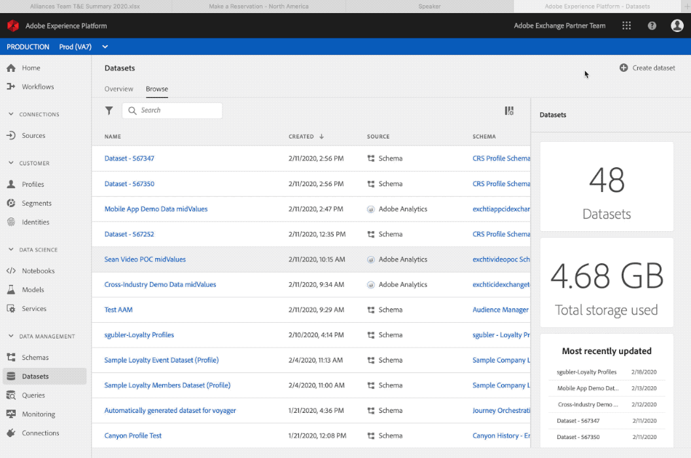

# Creare schemi e set di dati

In tutto l&#39;articolo viene fatto riferimento alla [raccolta Postman](https://github.com/Adobe-Marketing-Cloud/exchange-aep-profile-integration-postman) utilizzando le chiamate associate in base al numero. Ulteriori dettagli sull&#39;installazione e l&#39;utilizzo della raccolta Postman sono disponibili nella pagina Github [README](https://github.com/Adobe-Marketing-Cloud/exchange-aep-profile-integration-postman/blob/master/README.md). Sono inoltre presenti set di dati di esempio di [dati fedeltà](https://github.com/Adobe-Marketing-Cloud/exchange-aep-profile-integration-postman/blob/master/AEP%20loyalty%20events.json) e [profilo](https://github.com/Adobe-Marketing-Cloud/exchange-aep-profile-integration-postman/blob/master/AEP%20loyalty%20profiles.json).

## Schemi

Uno schema è un set di regole che rappresentano e convalidano la struttura e il formato dei dati. A un livello avanzato, gli schemi forniscono una definizione astratta di un oggetto reale (ad esempio una persona) e delineano quali dati includere in ogni istanza di tale oggetto (ad esempio nome, cognome, compleanno e così via). Gli schemi possono essere creati nell&#39;interfaccia utente o utilizzando le API [!DNL Experience Platform].

Consulta [questa documentazione](https://www.adobe.io/apis/experienceplatform/home/xdm/xdmservices.html#!api-specification/markdown/narrative/technical_overview/schema_registry/schema_composition/schema_composition.md) per ulteriori dettagli.

### Crea uno schema

I partner possono creare uno schema utilizzando l&#39;interfaccia utente seguendo questa [esercitazione](https://docs.adobe.com/content/help/en/experience-platform/xdm/tutorials/create-schema-ui.html). In questo esempio viene utilizzato lo schema del profilo del programma fedeltà. Anche se l’esempio è uno schema di profilo, gli schemi basati su eventi possono essere utilizzati utilizzando un processo simile.

Per utilizzare le API, i partner devono disporre di un&#39;integrazione Adobe I/O esistente con autorizzazioni [!DNL Experience Platform] abilitate. Consulta questa guida per [creare un&#39;integrazione I/O](https://www.adobe.io/apis/experienceplatform/home/tutorials/alltutorials.html#!api-specification/markdown/narrative/tutorials/authenticate_to_acp_tutorial/authenticate_to_acp_tutorial.md).

Quindi visita [questo collegamento](https://docs.adobe.com/content/help/en/experience-platform/xdm/tutorials/create-schema-api.html) per scoprire come creare schemi utilizzando l&#39;API.

Per creare uno schema tramite Postman, utilizza le chiamate contenute nelle cartelle 1: Crea schema, 1a: Crea schema per dati PROFILO OPPURE 1b: Crea schema per dati EVENTO.

## Set di dati

Tutti i dati inseriti nell&#39;Adobe [!DNL Experience Platform] sono contenuti nei set di dati. Un set di dati è un costrutto di archiviazione e gestione per una raccolta di dati, in genere una tabella, che contiene uno schema (colonne) e dei campi (righe). I set di dati contengono anche metadati che descrivono vari aspetti dei dati memorizzati.

Catalog Service è il sistema di registrazione per la posizione e la derivazione dei dati in [!DNL Experience Platform] e viene utilizzato per creare e gestire i set di dati. Il catalogo tiene traccia dei metadati per ogni set di dati, che include un riferimento allo schema Experience Data Model (XDM) a cui il set di dati è conforme (illustrato nella sezione successiva) e del numero di record acquisiti in tale set di dati.

Vai [qui](https://docs.adobe.com/content/help/en/experience-platform/catalog/datasets/overview.html) per una panoramica dettagliata del set di dati.

### Creare un set di dati

<!-- 
We don't yet support hover text in images (and we render it poorly when included). I removed "Creating a Dataset" from the above image link. We can add it back when we support it (Summer 2020?) -Bob
-->

Creare un set di dati tramite l’interfaccia utente:

1. Fare clic su **[!UICONTROL Crea set di dati]**.

1. Fai clic su **[!UICONTROL Crea da schema]**.

1. Fai clic su **[!UICONTROL Fine]**.

Vai [qui](https://docs.adobe.com/content/help/en/experience-platform/catalog/datasets/user-guide.html) per una guida utente per set di dati.

[Crea un set di dati utilizzando le API](https://docs.adobe.com/content/help/en/experience-platform/catalog/datasets/create.html).

Per creare un set di dati tramite Postman, utilizza le cartelle 2: Crea set di dati, 2a: Crea set di dati per i dati PROFILE OPPURE 2b: Crea set di dati per i dati EVENT.

## Best practice relative a schemi e set di dati per i partner

* I dati dei partner devono utilizzare uno schema di profilo separato, anziché creare un mix-in per lo schema di profilo e lo schema di esperienza esistenti di un cliente.
* I partner devono utilizzare, ove possibile, classi e mixin Adobi.
* I partner devono caricare i propri dati utilizzando un set di dati separato, anziché tentare di combinarli in un set di dati esistente.
* Per il momento i partner non possono caricare i loro schemi nel registro globale.
